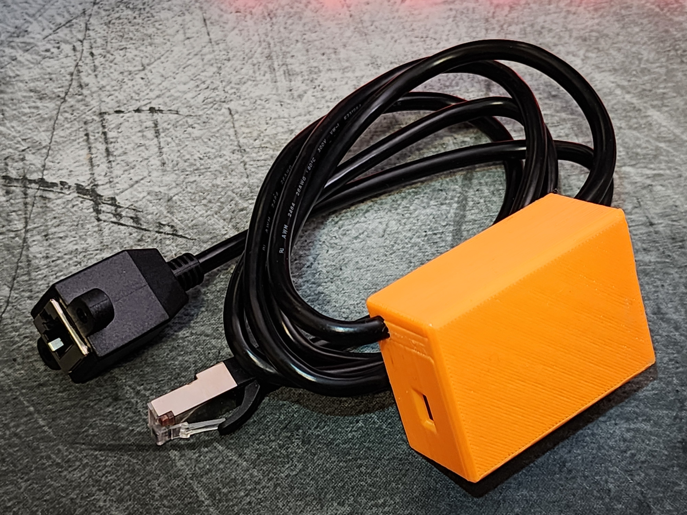
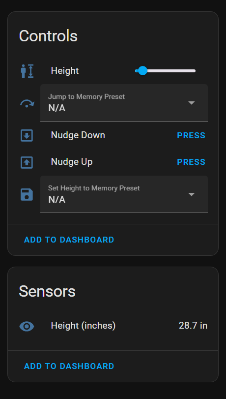
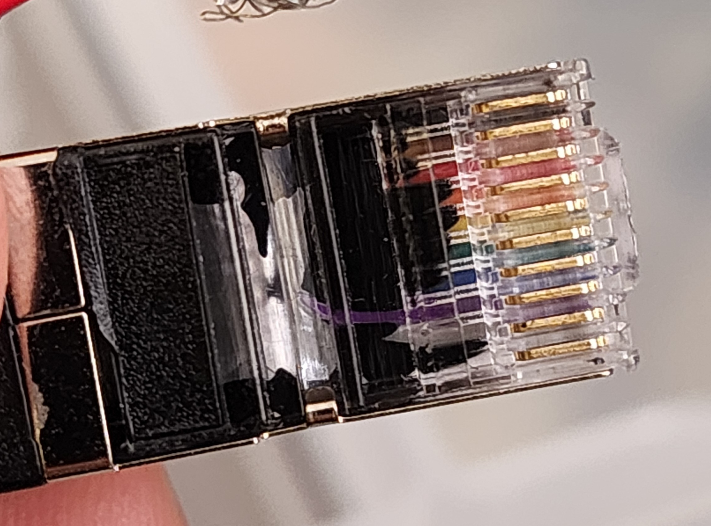
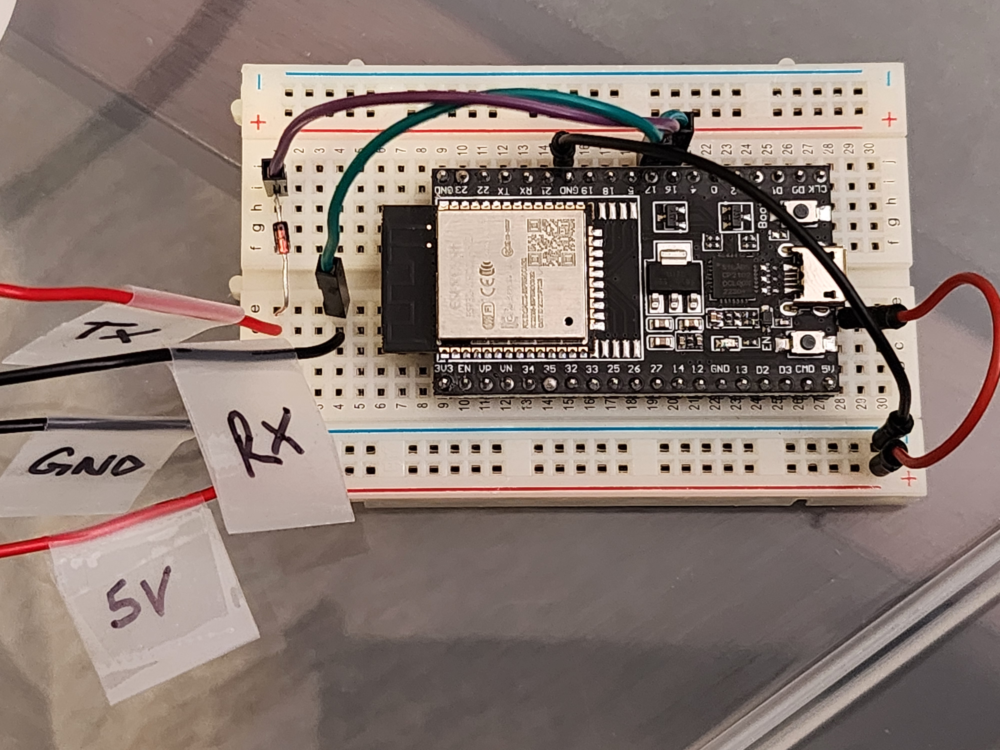
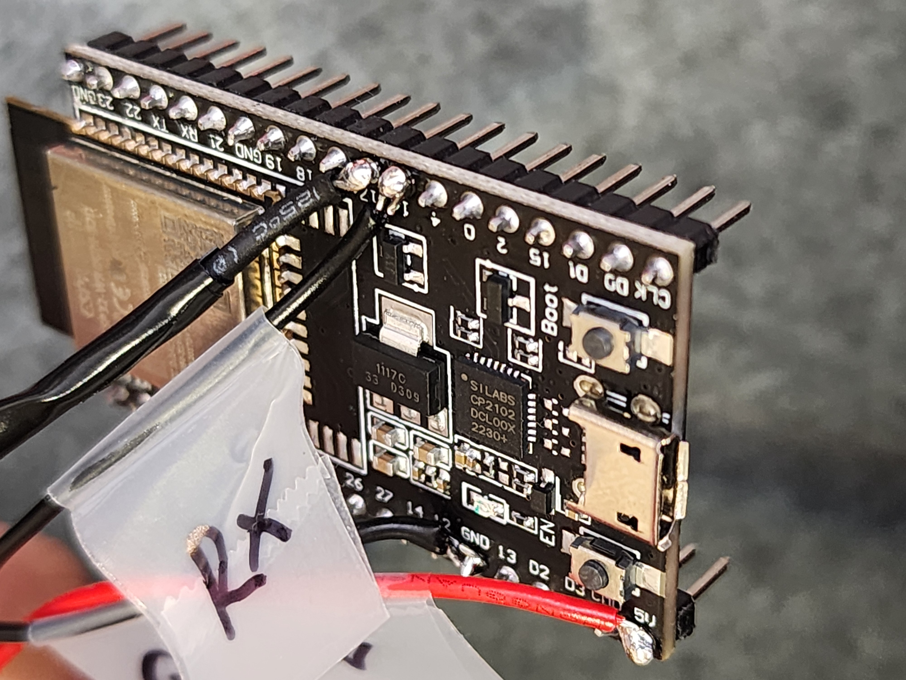
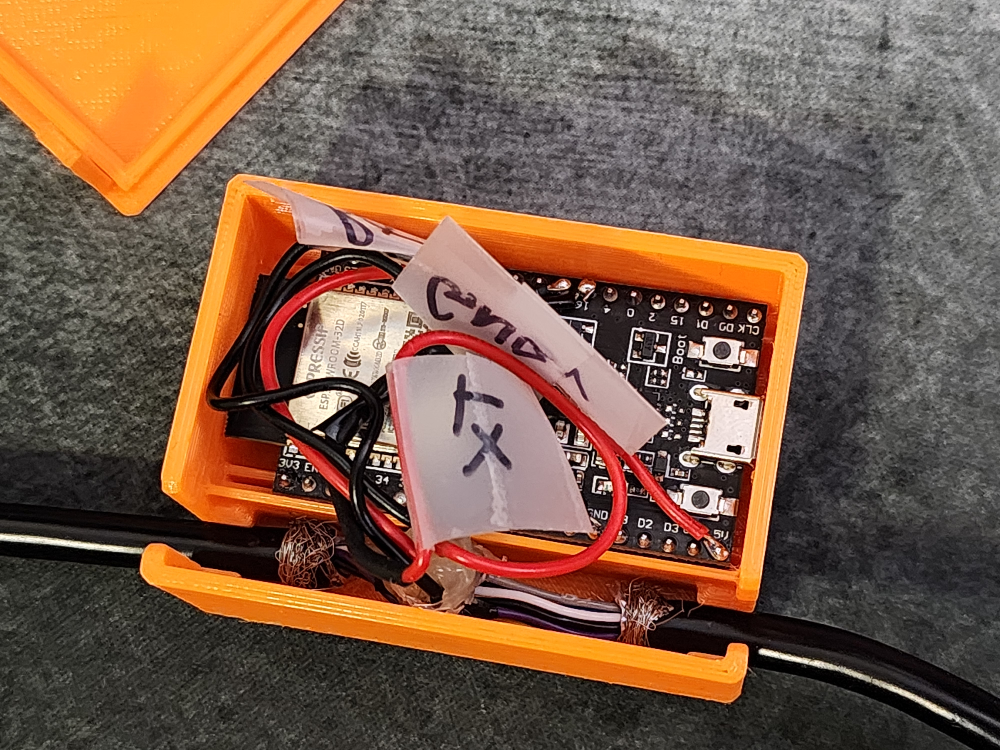
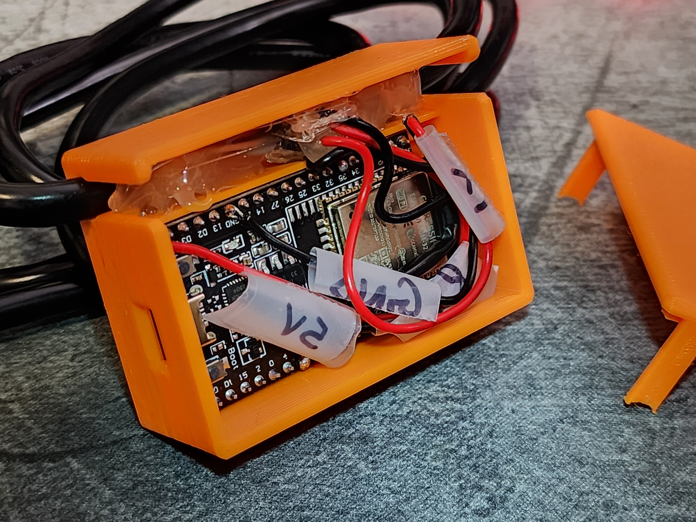

# SmartDesk 2 Control for ESPHome

Project to seamlessly integrate your Autonomous SmartDesk 2 with Home Assistant, while still retaining use of the controller keypad.

<br/>
<p align="center">
  
</p>

## Features

- Incrementally move desk up/down using buttons on Home Assistant
- Change desk height using a slider
- Read height of desk in inches
- Switch to one of four predefined height presets using a dropdown.
- Save the current desk height to one of the four memory presets, also with a dropdown.
<br/>


## Credit

This project was built with reference and inspiration from [vipial1](https://github.com/vipial1/desky-ha), [developit](https://github.com/developit/desky), and [Stefichen5](https://github.com/Stefichen5/AutonomousControl). After failing to run the Espruino server on my esp32, I adapted the communication logic for ESPHome. This had the benefit of making the Home Assistant integration trivial. I also added support for new features, like setting memory presets and reading the desk height in inches.

## Disclaimer

- It's your responsibility to ensure the desk doesn't collide with anything as it moves, which can cause injury or damage. Only use this integration when you are physically present to intervene.
  - Pressing UP/DOWN on the controller keypad should interrupt any command from this integration.
- Some low-voltage electronics work is needed. Use caution when using equipment like soldering irons and heat guns.

## Limitations

1. After pressing the UP/DOWN buttons on the keypad controller, certain integration features (moving to a user-defined height, memory preset save) fail until at least 30 seconds elapse. My guess is that the keypad controller sends continuous instructions for that duration, which interferes with the programmed sequence sent from the wireless controller.
2. Moving the desk to a user-defined height is functional but imperfect. E.g. suppose the desk is at height 80 (internal units, not inches), and you set the slider to 90 -- The desk will move up until the height is 90 +/- 3 and then slowly nudge up/down until it reaches 90 exactly. Compared to the smooth motion with presets, this is more janky.

## Getting started

### Hardware requirements

1. **ESP32 WROOM 3D development board**

2. **10P10C cable**:
   I used the 1.5M version of the [SinLoon RJ50 cable](https://www.amazon.ca/gp/product/B0B1ZKCRK4/)

4. **Soldering kit, wires (24 AWG) and wire stripper**

5. **1N4148 diode**:
   A 1N4148 diode is needed to continue using the keypad alongside the Home Assistant integration.

#### Optional but recommended:

1. **Heat-shrink tubes, electrical tape, hot glue**:
    For electrical insulation and for securing cable to housing

2. **Access to a 3D printer**:
   To print and use the included housing STL as in the project

### Electronics setup

1. Strip outer insulation of 10P10C cable.
   - If using provided 3D printable case, avoid stripping more than 35mm of insulation to allow for a secure fit.
2. Identify GND, RX, TX and 5V wires in the 10P10C cable. We will be tapping into these wires.
   - Refer to table below to find which PINs relate to which function.

  **Pin**   | **SinLoon RJ50** | **SmartDesk 2 cable** | **Function**
 -----------|------------------|-----------------------|--------------
  1         | Black            |                       |
  2         | Brown            |                       |
  3         | Red              |                       |
  4         | Orange           | Red                   | Sleep
  5         | Yellow           |                       |
  6         | Green            |                       |
  7         | Blue             | Orange                | GND
  8         | Purple           | Yellow                | RX
  9         | Gray             | Green                 | TX
  10        | White            | Blue                  | 5V

   - Check if your cable's pin color layout matches the layout for the SinLoon RJ50 cable. If so, simply use its layout to identify the relevant colors.
  <br/>
  <p align="center">
    
  </p>

3. Strip insulation off the 4 relevant inner wires and solder wires to them, making 3-way taps.
4. (Highly recommended) Create breadboard prototype with cable attached to ESP32 to verify the whole system works. Jump ahead to [ESPHome](#esphome-setup) and [Home Assistant](#home-assistant-setup) sections for testing.
   - Pin 16 (RX) of ESP32 is connected by green wire to tapped wire for RX.
   - Pin 17 (TX) is connected by purple wire to the 1N4148 diode, with the darker end (cathode) pointed towards the ESP32 side. Other end of diode connects to TX wire.
   <br/>
   <p align="center">
     
   </p>
   - I labelled the wire ends with their respective functions because I only had red/black wires on hand :/
5. Add shrink tubes before soldering the parts and wires to the top of the ESP32 board.
   <br/>
   <p align="center">
     
   </p>
6. (Optional) Print 3D casing using the included files and assemble.
   - When assembling, use a ziptie on either end of the stripped section, before fitting it into the case with hot glue. This will help the cable from coming loose.

  <br/>
  <p align="center">
    
    
  </p>

### ESPHome setup

1. Create a new device in ESPHome dashboard, and configure name, static ip address etc, as needed.
2. Set the remote package and substitutions by adding the following snippet. Refer to example.yml for more info.
   - Note: the min/max height is based on the extended model of the SmartDesk 2. If you have the regular model, the range is probably 75-123 based on [this gist](https://gist.github.com/developit/d610e45a522810b5287db61e554ae9c9).
  ```yaml
  packages:
    Autonomous_Desk: github://at-karan-sharma/autonomous-desk-esphome/config/desky.yml@main

  substitutions:
    uart_tx_pin: "17"
    uart_rx_pin: "16"
    desk_min_height: "66"
    desk_max_height: "131"
  ```
3. Install config to the ESP32 over wireless/serial connection.

### Home Assistant setup

1. Look for the new ESPHome device in Home Assistant > Settings > "Devices & services" under the "Discovered" section.
2. Click on "Configure" and add the encryption key (if configured in ESPHome) to finalize setup.

## Contribution

Feel free to contribute to this project by submitting issues or pull requests. Feedback and suggestions are also welcomed.
